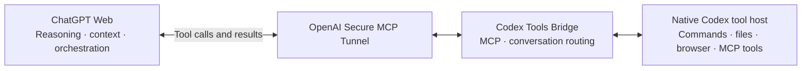

# Codex Tools Bridge

**Keep the conversation in ChatGPT. Bring your local tools to it.**

[简体中文](README.zh-CN.md) · [Setup](docs/SETUP.md) · [Architecture](docs/ARCHITECTURE.md) · [Security](SECURITY.md)

Codex Tools Bridge lets ChatGPT Web discover and call native local Codex tools through MCP. ChatGPT handles reasoning, tool orchestration, and conversation context; the local host executes tools and returns their results. There is **no second model loop** in the bridge.

> **Experimental, macOS-first.** Extracted from a working personal deployment. The standalone repository has regression tests, but that is not a guarantee of compatibility with every Desktop build, plugin, or operating system. Desktop cold start still requires starting its dedicated tool-host task once. See [known limitations](docs/SETUP.md#known-limitations).

## Why this exists

I started with [miuuyy/codex-chatgpt-web](https://github.com/miuuyy/codex-chatgpt-web). For my workflow, I did not want to put the full Codex conversation harness in charge of a ChatGPT Web conversation. The web app already handled the conversation and context well; what I wanted to add was access to my computer's tools.

So I changed the direction: **instead of using ChatGPT Web as Codex's model backend, let ChatGPT Web use Codex as a local tool host.**

This is not just an inspiration credit. The project extracts and modifies MIT-licensed upstream tool-gateway and Responses-protocol code, and includes the local session implementation. See [NOTICE](NOTICE.md), [the original license](LICENSES/upstream-MIT.txt), and [provenance](UPSTREAM.json).

## The flow



The transport is [OpenAI's official Secure MCP Tunnel](https://developers.openai.com/api/docs/guides/secure-mcp-tunnels), with a separately installed [tunnel-client](https://github.com/openai/tunnel-client). This independent project is **not an official OpenAI product**. The tunnel connection does not mean a public plugin-store listing.

## What you can do

- Ask ChatGPT to inspect a local repository, run commands, edit files, and check actual outputs without copying terminal text back and forth.
- Return actual image content and preserve structured tool results, rather than reducing everything to plain text. Browser/computer tools require a compatible native host and its permissions.
- Discover the native registry, including available MCP/plugin tools, then invoke the exact tool and schema. Available tools depend on your installation; this is not a promise that every plugin is supported.
- Keep separate chat-to-task mappings. Subsequent calls reuse the chat's local context; native REPL state can survive across calls.

The default gateway blocks known recursive and model-starting tool entry points. This is an architectural guardrail, **not a security sandbox**: an authorized shell can still run programs, and third-party tools may have their own network access, inference, or costs.

## Start here

```sh
git clone https://github.com/KunHcz/codex-tools-bridge.git
cd codex-tools-bridge
bun install --frozen-lockfile --ignore-scripts
bun run verify
bun src/cli.ts --help
```

Use Bun 1.3.11 for the tested baseline. The local development host used Codex CLI 0.153.4; native Desktop tool availability is build-dependent. Install Codex and the official tunnel client separately.

**Continue with the [installation guide](docs/SETUP.md).** It covers a fresh dedicated workspace, explicit Desktop initialization, the official tunnel profile, connecting a private ChatGPT plugin, and a harmless acceptance check. No personal runtime profile or credentials are distributed.

## Design boundaries

“No second model loop” does **not** mean “no Codex runtime.” The implementation still uses a native Codex task/turn and a localhost Responses driver to obtain real tool context, native permissions, and results. It does not reuse the upstream browser-driven conversation orchestrator, copy browser cookies, or supply another model provider for reasoning.

A live driver may appear as a running task in Desktop while it waits for web requests. Idle cleanup conservatively retains stateful runtimes and uncertain background work. A tunnel marked ready does not prove the native tool host is online. Unknown outcomes are never automatically replayed.

Chat mappings are separate, but the filesystem, applications, and physical desktop can be shared. This is a **single-user tool bridge**, not a multi-tenant service. Requested tool results leave your machine and are sent to ChatGPT. Read [SECURITY.md](SECURITY.md) before connecting sensitive projects.

## Development

```sh
bun run typecheck
bun test ./tests
bun run check:release
```

Tests exercise the protocol with fake hosts and isolated temporary directories. They do not start a paid model or require tunnel credentials. Live Desktop/browser acceptance is a separate, explicit check; automated tests do not establish complete end-to-end compatibility.

Contributions should keep the bridge small and preserve the web-owned conversation model. See [CONTRIBUTING.md](CONTRIBUTING.md).

## License

[MIT](LICENSE), including retained upstream MIT attribution. Codex, installed plugins, and OpenAI's tunnel client are external dependencies with their own licenses and terms.
